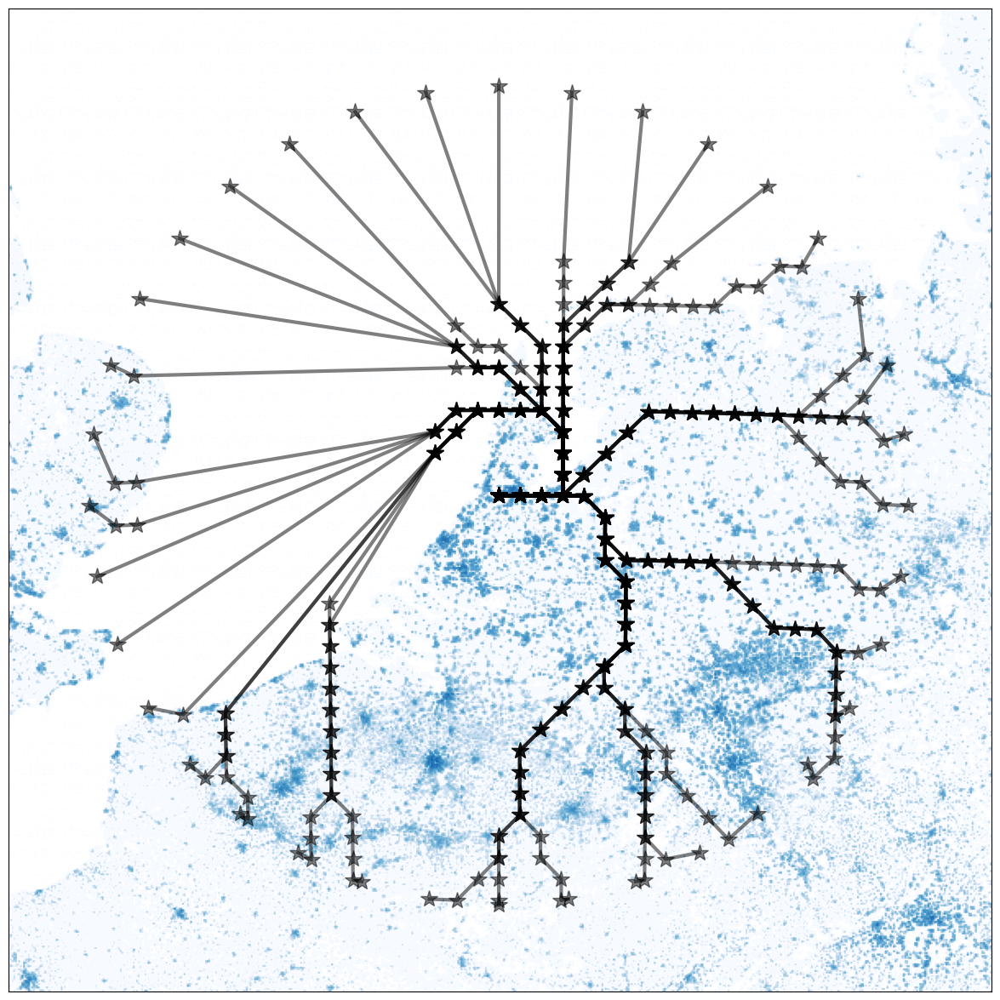
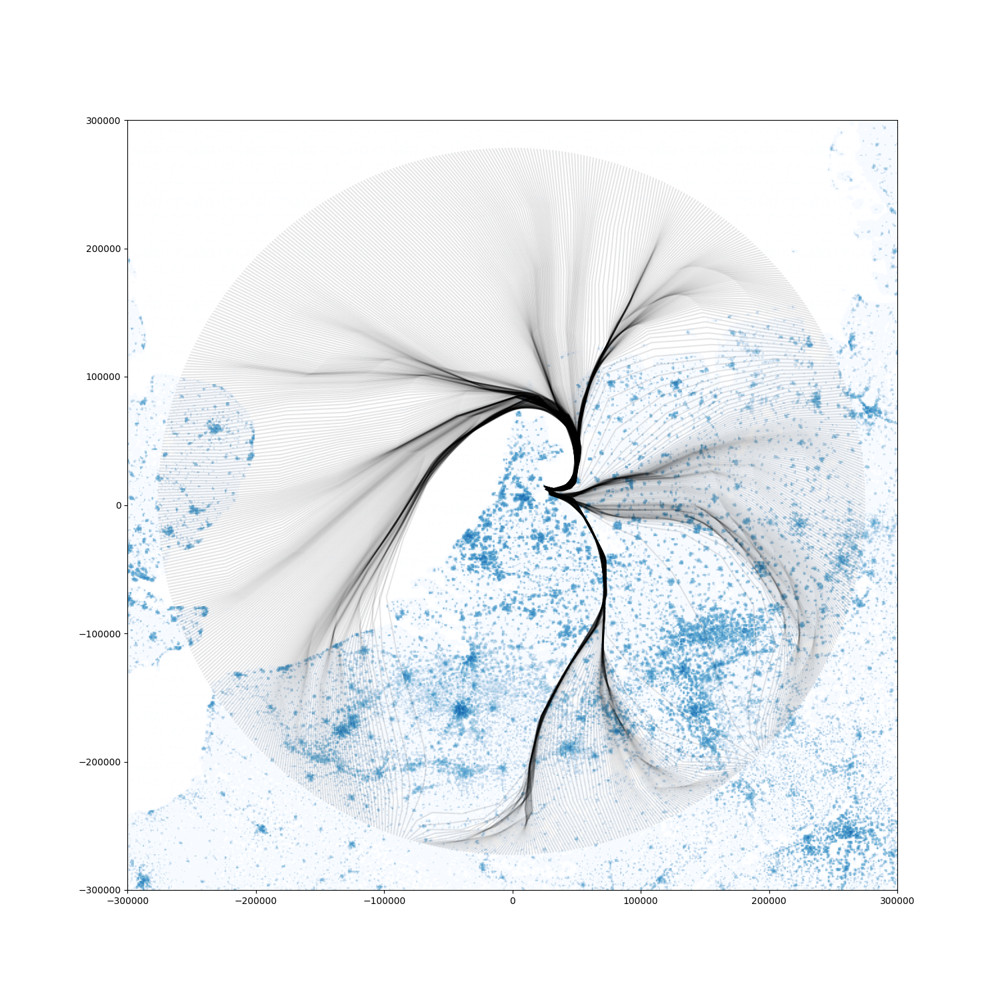

## Code accompanying the paper: "Aircraft Path Planning for Arrival in Continuous Environments with Deep Reinforcement Learning."

The paper is currently not yet published, but will be linked here when available.

### Setup of the code
The code is structured in 3 folders, all using the same population data, obtained from [Eurostats](https://ec.europa.eu/eurostat/web/gisco/geodata/reference-data/grids). 
The discrete_environment folder contains all of the code related to the discretization, Dijkstra solutions and postprocessing of the Dijkstra output. The continuous_environment folder contains a fork of the [BlueSky Open Air Traffic Simulator](https://github.com/TUDelft-CNS-ATM/bluesky) repository, with all of the plugins related to training the Deep Reinforcement Learning algorithm, and evaluating of the paths in the continuous environment. Finally the policy_plotter folder contains all of the tools for generating the visuals presented in the paper. 

#### discrete_environment
The main code of this folder is in /dijkstra/graph_from_grid.py, this script takes as an input on of the grid-worlds stored in the /gridworld folder together with a fuel to noise ratio to determine the optimal paths for this environment using the dijkstra algorithm and postprocesses them to be more optimal above zero population areas. These paths are then stored as a sequence of nodes in the /node_paths folder. node2latlon.py takes these nodes and translates them to a list of coordinates that can be evaluated in the continuous environment with BlueSky.

<figure>
  
  <figcaption>Example of paths generated by the Dijkstra methods for a grid-world with cell sizes of 13x13km</figcaption>
</figure>

#### continuous_environment
The main code accompanying this paper can be found in the plugins folder of this folder. All other code is related to the core functionalities of [BlueSky](https://github.com/TUDelft-CNS-ATM/bluesky). In the plugins folder the fuelconsumption.py and noisepollution.py scripts are used for generating the costs of the flown paths. SAC_trainer.py is used when training new SAC models, and SAC_evaluator.py is used to evaluate the trained models over a standardized set of test scenarios. Similarly, dijkstra_evaluator.py, evaluates the dijkstra solutions over these same scenarios for fair comparisson.

<figure>
  
  <figcaption>Example of paths generated by the SAC method directly in the continuous environment</figcaption>
</figure>

#### policy_plotter
This folder contains all of the weights of the trained models, and figures showing the policy of the different models plotted over the continuous environment. The folder also contains the code used for generating the figures.
